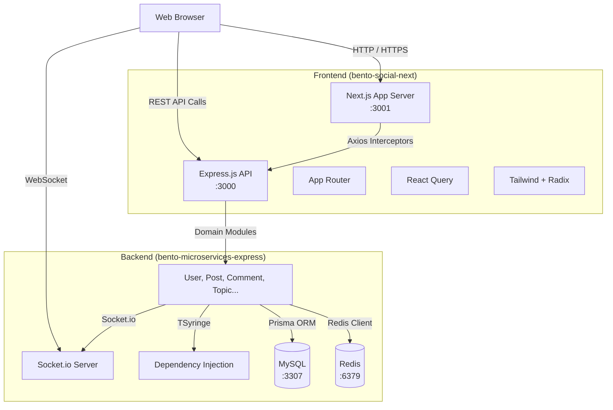

# Social Network 500Bros - System Architecture

## Executive Summary
The Social Network 500Bros application is built on a flattened monorepo architecture consisting of a Next.js frontend (`bento-social-next`) and an Express.js microservices-style backend (`bento-microservices-express`). The system relies on MySQL for persistent data storage and Redis for caching and real-time features, orchestrated via Docker Compose.

## System Architecture Diagram

## Architectural Patterns

### 1. Monorepo Execution
The repository uses a single root with shared Windows Batch scripts (`start-localhost.bat`, `start-network.bat`, `stop.bat`) that coordinate spinning up the Docker containers (for MySQL and Redis) alongside the Node.js instances for frontend and backend. 

### 2. Frontend Architecture (Next.js)
- **Framework**: Next.js 14 utilizing the modern App Router (`src/app/`).
- **Data Fetching & State**: Uses `react-query` for asynchronous state management and data fetching.
- **Service Layer**: An isolated API module (`src/apis/`) groups endpoints by entity, wrapped by an Axios instance containing interceptors for authentication and error handling.
- **Dependency Injection**: Uncommonly, the frontend also utilizes `tsyringe` for dependency injection.

### 3. Backend Architecture (Express.js)
- **Domain-Driven Modules**: The application is sliced into vertical domains (e.g., `user`, `post`, `comment`, `conversation`). Each module contains its own routes, controllers, and services.
- **Dependency Injection**: Uses `tsyringe` (`@injectable()`) to decouple services, repositories, and controllers, making unit testing and abstraction easier.
- **Data Access**: `Prisma` is the exclusive ORM mapping onto the MySQL database. The schema acts as the single source of truth (`prisma/schema.prisma`).
- **Real-time & Caching**: Integrates `Socket.io` for real-time messaging/notifications and `Redis` for caching and potentially session management.

### 4. Database Lifecycle
Database structures are managed outside the direct application flow through a dedicated `sync-db` directory that hooks into the running Docker `mysql-bento` container for importing and exporting `.sql` dumps.
