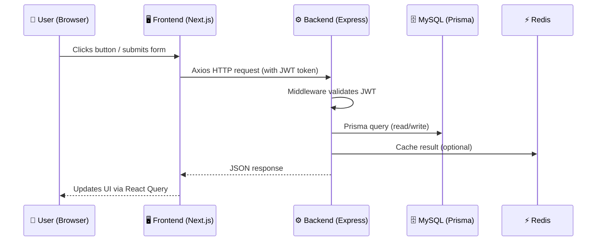
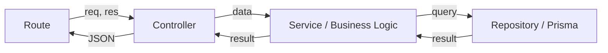
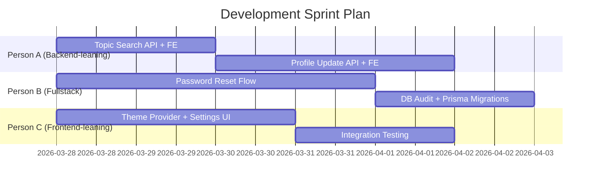

# Project Management Guide for Bento Social Network

> A practical playbook for managing, planning, and delegating work on this social network project.

---

## Part 1: Understanding Your Project Before You Plan

Before assigning any work, a PM must deeply understand the system. Here's how to think about **this** project:

### 1.1 – Map the System Boundaries

Your project has **3 clear boundaries** (think of them as "teams" or "zones"):

| Zone | Folder | Core Skill Needed |
|---|---|---|
| **Frontend** | `/bento-social-next` | React, Next.js, Tailwind CSS |
| **Backend** | `/bento-microservices-express` | Express.js, Prisma, REST APIs |
| **Infrastructure** | Root scripts, Docker, `/sync-db` | Docker, MySQL, Redis, DevOps |

> [!TIP]
> **Rule of Thumb:** Every feature request will touch at least Frontend + Backend. Infrastructure is touched less often, but is critical during setup and deployment.

### 1.2 – Understand the Data Flow

For every feature, trace the data path. Here's a universal pattern in this project:



**Why this matters for a PM:** When a teammate says "it's done on the backend," you know to ask: *"Did you also update the frontend API call and the React Query hook?"* — because the feature isn't truly done until the full data flow works end-to-end.

---

## Part 2: Planning the Architecture (How to Think Like an Architect)

### 2.1 – The "Module = Mini-App" Mental Model

This backend uses a **domain-driven module structure**. Each folder in `src/modules/` is a self-contained mini-application:

```
src/modules/
  ├── user/          → Everything about users (register, login, profile)
  ├── post/          → Creating, editing, deleting posts
  ├── comment/       → Comments on posts
  ├── conversation/  → Real-time messaging
  ├── topic/         → Topic/category management
  ├── following/     → Follow/unfollow logic
  ├── notification/  → Push notifications
  ├── media/         → Image/file uploads
  ├── post-like/     → Liking posts
  ├── post-save/     → Bookmarking posts
  └── comment-like/  → Liking comments
```

> [!IMPORTANT]
> **Architecture Tip:** When planning a new feature, ask: *"Does this belong to an existing module, or does it need a new one?"*
> - Adding "edit post" → Goes into the existing `post/` module.
> - Adding "stories" → Probably needs a **new** `story/` module.

### 2.2 – Each Module's Internal Structure

Every module follows the same pattern (this is what you enforce as PM):

```
modules/user/
  ├── user.routes.ts       → Defines URL endpoints (e.g., GET /v1/users/:id)
  ├── user.controller.ts   → Handles HTTP request/response logic
  ├── user.service.ts       → Contains business rules
  └── user.repository.ts   → Talks to the database via Prisma
```



> [!TIP]
> **Why this layering matters:** If a teammate puts database queries directly in the controller, politely ask them to move it to the repository. This separation makes code testable and maintainable.

---

## Part 3: How to Break Down and Delegate Tasks

### 3.1 – The "Vertical Slice" Strategy (Recommended)

Instead of assigning "Person A does all backend, Person B does all frontend," assign **complete features** to individuals:

| ❌ Bad (Horizontal Split) | ✅ Good (Vertical Slice) |
|---|---|
| Person A: All backend routes | Person A: Topic search (backend + frontend) |
| Person B: All frontend pages | Person B: Password reset (backend + frontend) |
| Person C: All database work | Person C: Profile update (backend + frontend) |

**Why:** Each person owns and understands the full feature. No one is blocked waiting for another person's API to be "ready."

### 3.2 – Task Breakdown Template

For every issue from `PLAN.md`, break it down using this checklist template before assigning:

```markdown
## Feature: [Feature Name]
**Assignee:** @teammate
**Branch:** `feature/[short-name]` (branched from `long-dev`)
**Estimated effort:** S / M / L / XL

### Backend Tasks
- [ ] Define/update Prisma schema (if needed) and run `prisma migrate dev`
- [ ] Create/update route in `modules/[name]/[name].routes.ts`
- [ ] Implement controller logic
- [ ] Implement service layer with business rules
- [ ] Implement repository layer (Prisma queries)
- [ ] Add Zod validation schemas
- [ ] Test with Postman (use the included `.postman_collection.json`)

### Frontend Tasks
- [ ] Create/update API function in `src/apis/[entity].ts`
- [ ] Add React Query hook (`useQuery` / `useMutation`)
- [ ] Build/update UI component(s)
- [ ] Handle loading, error, and empty states
- [ ] Test in browser

### Definition of Done
- [ ] Feature works end-to-end (browser → API → database → back)
- [ ] No console errors in browser or server terminal
- [ ] Code pushed to feature branch and PR created against `long-dev`
```

### 3.3 – Applying This to the Current 5 Issues

Here is a suggested assignment plan for a **3-person team**:



| Issue | Assignee | Effort | Dependencies |
|---|---|---|---|
| #1 Topic Search | Person A | Small (2 days) | None |
| #2 Profile Update | Person A | Medium (3 days) | After #1 (same module area) |
| #3 Password Reset | Person B | Medium-Large (4 days) | Needs email service setup |
| #4 DB Audit | Person B | Small (2 days) | After #3 (related to schema) |
| #5 Theme/Settings | Person C | Medium (3 days) | None (independent frontend work) |

---

## Part 4: Daily Management Rituals

### 4.1 – Daily Standup (15 min max)

Each person answers 3 questions:
1. **What did I finish yesterday?**
2. **What am I working on today?**
3. **Am I blocked on anything?** ← *This is the most important one.*

### 4.2 – PR Review Checklist

When reviewing a teammate's Pull Request, check:

- [ ] Does the code follow the module structure? (route → controller → service → repository)
- [ ] Is there Zod validation on API inputs?
- [ ] Are there no hardcoded values (use `.env` instead)?
- [ ] Does the frontend handle loading/error states?
- [ ] Has the Postman collection been tested?

### 4.3 – Branch Strategy

```mermaid
gitgraph
    commit id: "main"
    branch long-dev
    commit id: "docs: consolidated markdown"
    branch feature/topic-search
    commit id: "feat: topic search API"
    commit id: "feat: topic search UI"
    checkout long-dev
    merge feature/topic-search
    branch feature/password-reset
    commit id: "feat: forgot password endpoint"
    commit id: "feat: reset password UI"
    checkout long-dev
    merge feature/password-reset
    checkout main
    merge long-dev id: "v1.1 release"
```

- `main` → Production-ready code only.
- `long-dev` → Integration branch where features are merged and tested together.
- `feature/*` → One branch per feature, branched from `long-dev`.

---

## Part 5: Common Pitfalls & How to Avoid Them

| Pitfall | Why It Happens | How to Prevent |
|---|---|---|
| **"It works on my machine"** | Different `.env` files, Docker not running | Ensure everyone runs `docker-compose up -d` first and shares the same `.env.example` |
| **Merge conflicts** | Two people edit the same file | Use vertical slices (different modules = different files) |
| **Feature creep** | Teammate adds extra unplanned features | Define a clear "Definition of Done" per task; extras go to a new issue |
| **Database out of sync** | Someone adds a Prisma migration, others don't pull it | Rule: After every `git pull`, run `npx prisma migrate dev && npx prisma generate` |
| **No one tests the full flow** | Backend devs only test APIs, frontend devs only test UI | Require end-to-end testing on the PR checklist before merging |

---

## Part 6: Quick Reference Commands

```bash
# Start development environment
./start-localhost.bat              # Boots Docker + both servers

# Backend development
cd bento-microservices-express
pnpm install                       # Install dependencies
pnpm dev                           # Start backend server (:3000)
npx prisma migrate dev             # Apply database changes
npx prisma generate                # Regenerate Prisma client
npx prisma studio                  # Visual database browser (very useful!)

# Frontend development
cd bento-social-next
pnpm install                       # Install dependencies
pnpm dev                           # Start frontend server (:3001)

# Git workflow
git checkout long-dev              # Switch to integration branch
git pull origin long-dev           # Get latest changes
git checkout -b feature/my-feature # Create your feature branch
git push -u origin feature/my-feature  # Push and track your branch
```

---

> [!NOTE]
> **Final advice:** The best project managers don't just track tasks — they **remove blockers**. If someone is stuck on a Prisma migration or a Docker issue, jump in and help them get unblocked. The team's velocity is only as fast as its slowest blocker.
