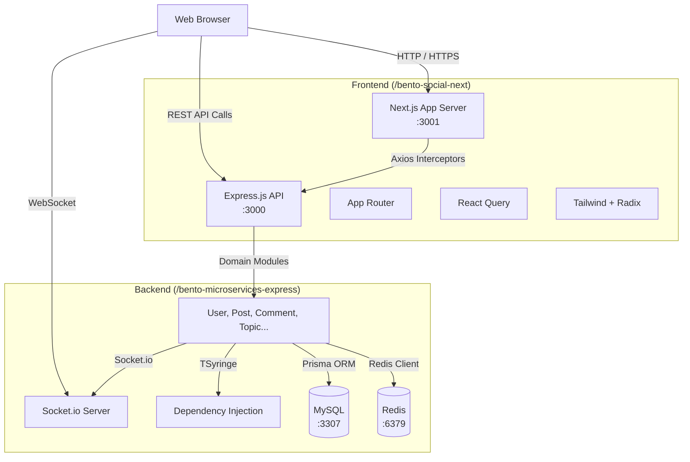

# Bento Social Network

A social networking application utilizing a microservices architecture with Next.js for the frontend and Express.js (Domain-driven) for backend services. 

---

## 1. Getting Started & Setup

### Prerequisites
- Node.js and npm/pnpm
- Docker and Docker Compose
- MySQL and Redis (via Docker)

### Installation
1. Clone the repository and navigate into the folder.
2. Install dependencies:
   ```bash
   # Install backend dependencies
   cd bento-microservices-express
   pnpm install

   # Install frontend dependencies
   cd ../bento-social-next
   pnpm install
   ```

### Running the Application

**Local Development:**
1. Double-click `start-localhost.bat` (This starts Docker services, migrates the DB, and launches servers).
2. Access Frontend at `http://localhost:3001` and Backend at `http://localhost:3000`.

**Network Access (LAN):**
1. Double-click `start-network.bat` (Configures things to bind to `0.0.0.0` for access across your local network).
2. Access via your local IP address.

**Stopping the App:**
Double-click `stop.bat` to gracefully spin down all Docker containers and Node processes.
> *Note:* The project relies on `.env.development` and `.env.network` depending on how you launch it. Modifying database credentials requires updating these environment variables.

---

## 2. System Architecture & Codebase Map

This project employs a flattened monorepo structure containing both applications separated by folders, relying on root batch scripts for execution.



### Module Breakdown
1. **Root Scripts (`/`)**: `.bat` scripts orchestrate the environment, Docker compose (`docker-compose.yml`), and boot the apps.
2. **Frontend Applications (`/bento-social-next`)**: Next.js 14 utilizing the App Router. Isolated API calls via `src/apis/` interacting with components and context.
3. **Backend Applications (`/bento-microservices-express`)**: Microservice-style domains (`src/modules/*`) mapping distinct business rules. 

---

## 3. Technical Specification

### Frontend Stack (`bento-social-next`)
- **Core:** Next.js 14.2 (App Router), React 18, TypeScript
- **Styling & UI:** Tailwind CSS, Radix UI Primitives, Framer Motion, Lucide React
- **State Processing:** React Query (`react-query`), React Hook Form, Zod (Validation)
- **Networking:** Axios, Socket.io Client, Simple-peer (WebRTC real-time media)
- **Patterns:** TSyringe (Dependency Injection)

### Backend Stack (`bento-microservices-express`)
- **Core:** Express.js (v5), TypeScript
- **Database ORM:** Prisma (`@prisma/client` v5) interacting with MySQL
- **Real-time & Cache:** Socket.io (v4), Redis Client (v4)
- **Patterns:** TSyringe (Dependency Injection decoupling controllers/services/repos)
- **Data & Security:** Bcrypt, JWT, Helmet, Cors, Zod, Multer + Sharp (Image optimization)

---

## 4. Database Synchronization

Because the MySQL database runs inside a Docker container, managing local backups requires specialized scripts contained within `/sync-db`:

**Exporting Database:**
1. Navigate to `/sync-db` and run `export-db.bat`
2. Locate the `.sql` dump inside `sync-db/dumps/` (It will be timestamped).

**Importing Database:**
1. Ensure your `.sql` dump is placed in `sync-db/dumps/`.
2. Run `import-db.bat` and select the file from the prompt.
3. *Note:* The import process stops any running containers and overwrites the active development database.

---

## 5. Contributing
1. Create a new branch for your feature (`git checkout -b your-branch-name`)
2. Review `PLAN.md` for active issues and tasks.
3. Make and test your changes.
4. Submit a Pull Request.