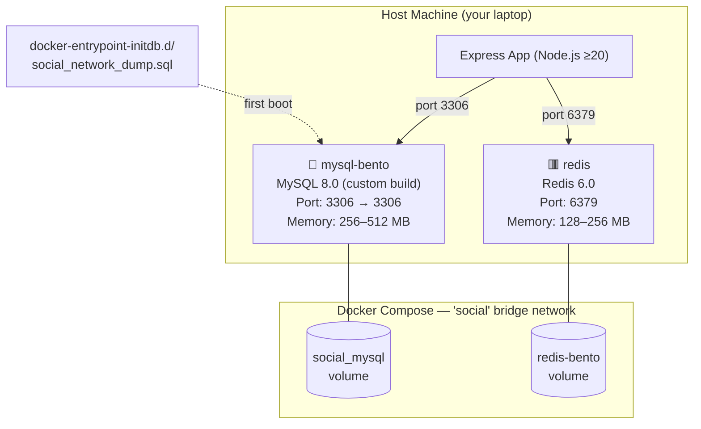

# Docker Architecture — bento-microservices-express

> Overview of the Docker infrastructure powering the backend of **Social-network-500bros**.

---

## High-Level Architecture



---

## Services

### 1. 🐬 MySQL (`mysql-bento`)

| Property | Value |
|---|---|
| **Image** | Custom build from `mysql/Dockerfile` (base: `mysql:8.0`) |
| **Container name** | `mysql-bento` |
| **Port mapping** | `3306` (host) → `3306` (container) |
| **Restart policy** | `unless-stopped` |
| **Memory** | 256 MB reserved, 512 MB limit |
| **CPU** | 0.25 reserved, 0.5 limit |

#### Custom Build (`mysql/Dockerfile`)

```dockerfile
FROM mysql:8.0
COPY my.cnf /etc/mysql/conf.d/custom.cnf   # Injects custom MySQL config
RUN chmod 644 /etc/mysql/conf.d/custom.cnf
CMD ["mysqld"]
```

#### Key MySQL Tuning (`mysql/my.cnf`)

| Setting | Value | Why |
|---|---|---|
| `max_connections` | 100 | Limits concurrent DB connections |
| `innodb_buffer_pool_size` | 256 MB | Main memory cache for InnoDB data/indexes |
| `innodb_flush_log_at_trx_commit` | 2 | Flush to OS every sec (faster, slight durability trade-off) |
| `performance_schema` | OFF | Saves RAM on dev machines |
| `slow_query_log` | OFF | No logging overhead in dev |

Secrets are **not hardcoded** in `docker-compose.yml`. Both services load them via:

```yaml
env_file:
  - ../startup/.env
```

| Variable | Loaded from `startup/.env` |
|---|---|
| `MYSQL_ROOT_PASSWORD` | `tintin111` |
| `MYSQL_DATABASE` | `longvo_dev` |
| `REDIS_PASSWORD` | `macdogiahuy_redis` |

#### Auto-Init: `social_network_dump.sql`

On **first boot**, MySQL automatically runs `docker-entrypoint-initdb.d/social_network_dump.sql`. This creates the full schema with **14 tables**:

| Table | Purpose |
|---|---|
| `users` | User profiles (username, avatar, bio, role, password hash+salt) |
| `posts` | User posts with content, image, topic, like/comment counts |
| `comments` | Threaded comments (supports `parent_id` for replies) |
| `comment_likes` | Many-to-many: comment ↔ user likes |
| `post_likes` | Many-to-many: post ↔ user likes |
| `post_saves` | Bookmarked/saved posts |
| `post_tags` | Many-to-many: post ↔ tag |
| `tags` | Content tags |
| `topics` | Post categories (Technology, Sports, Travel, etc.) with colors |
| `followers` | Follower/following relationships |
| `notifications` | Push-style notifications (liked, followed, replied) |
| `stories` | Ephemeral stories with expiry |
| `story_likes` | Story like tracking |
| `story_views` | Story view tracking |
| `chat_rooms` | Direct/group chat rooms |
| `chat_messages` | Chat messages within rooms |
| `_prisma_migrations` | Prisma ORM migration tracking |

#### Healthcheck

```yaml
test: ["CMD", "mysqladmin", "ping", "-h", "localhost"]
interval: 30s
timeout: 10s
retries: 5
start_period: 30s   # grace period for MySQL to initialize
```

#### Volume

`social_mysql` → `/var/lib/mysql` — Persists database data across container restarts.

---

### 2. 🟥 Redis (`redis`)

| Property | Value |
|---|---|
| **Image** | `redis:6.0` (official, no custom build) |
| **Container name** | `redis` |
| **Port mapping** | `6379` (host) → `6379` (container) |
| **Restart policy** | `unless-stopped` |
| **Memory** | 128 MB reserved, 256 MB limit |
| **CPU** | 0.1 reserved, 0.3 limit |

#### Key Redis Config (`redis/redis.conf`)

| Setting | Value | Why |
|---|---|---|
| `bind` | `0.0.0.0` | Accept connections from all interfaces |
| `maxmemory` | 256 MB | Hard memory cap |
| `maxmemory-policy` | `allkeys-lru` | Evict least-recently-used keys when full |
| `appendonly` | yes | AOF persistence (append-only file) |
| `appendfsync` | everysec | Sync to disk every second |
| `save` | 900/1, 300/10, 60/10000 | RDB snapshot intervals |
| `requirepass` | `${REDIS_PASSWORD}` | Password auth from env variable |
| `maxclients` | 100 | Connection limit |

#### Volume

`redis-bento` → `/data` — Persists Redis AOF and RDB snapshot data.

---

## Network

```yaml
networks:
  social:
    driver: bridge
```

Both `mysql-bento` and `redis` sit on the same **bridge network** named `social`. This means:
- Containers can reach each other by **container name** (e.g., `redis:6379` from inside MySQL's container)
- Port mappings (`3306:3306`, `6379:6379`) expose them to the **host** (your app running via `yarn dev`)
- Isolated from other Docker networks on your machine

---

## How It All Connects

```
┌────────────────────────────────────────────────────────┐
│  Host Machine                                          │
│                                                        │
│  ┌──────────────────────┐                              │
│  │  Express App          │                              │
│  │  (yarn dev, port 3000)│                              │
│  └──────┬───────┬────────┘                              │
│         │       │                                       │
│    :3306│       │:6379                                  │
│         ▼       ▼                                       │
│  ┌─────────────────────────── Docker bridge ──────────┐ │
│  │                                                     │ │
│  │  mysql-bento:3306        redis:6379                 │ │
│  │  ┌─────────────┐        ┌────────────┐             │ │
│  │  │ MySQL 8.0   │        │ Redis 6.0  │             │ │
│  │  │ social_     │        │ cache,     │             │ │
│  │  │  network db │        │ sessions   │             │ │
│  │  └──────┬──────┘        └─────┬──────┘             │ │
│  │         │                     │                     │ │
│  │   social_mysql/         redis-bento/                │ │
│  │   (persistent vol)      (persistent vol)            │ │
│  └─────────────────────────────────────────────────────┘ │
└────────────────────────────────────────────────────────┘
```

1. **`docker compose up -d`** starts MySQL + Redis in containers
2. On first boot, MySQL runs `social_network_dump.sql` to seed the schema + data
3. Express app runs on the **host** (not in Docker), connects to MySQL on `localhost:3306` and Redis on `localhost:6379`
4. Named volumes persist data — `docker compose down` stops containers but keeps data; `docker compose down -v` deletes everything

---

## ✅ Secrets Management

All secrets are stored in `startup/.env` (gitignored) and loaded into both services via `env_file`. **Nothing sensitive is hardcoded in `docker-compose.yml`.**

```
startup/.env  ←  single source of truth
     │
     ├── docker-compose.yml  (env_file: ../startup/.env)
     └── start-network.sh    (source "$ENV_FILE")
```

---

## Quick Reference Commands

```bash
# Start services
docker compose up -d

# Stop services (keep data)
docker compose down

# Stop services + delete all data
docker compose down -v

# View running containers
docker ps

# View MySQL logs
docker compose logs mysql

# Connect to MySQL CLI
docker compose exec mysql mysql -u root -p"${MYSQL_ROOT_PASSWORD}" "${MYSQL_DATABASE}"

# Connect to Redis CLI
docker compose exec redis redis-cli -a "${REDIS_PASSWORD}"
```
