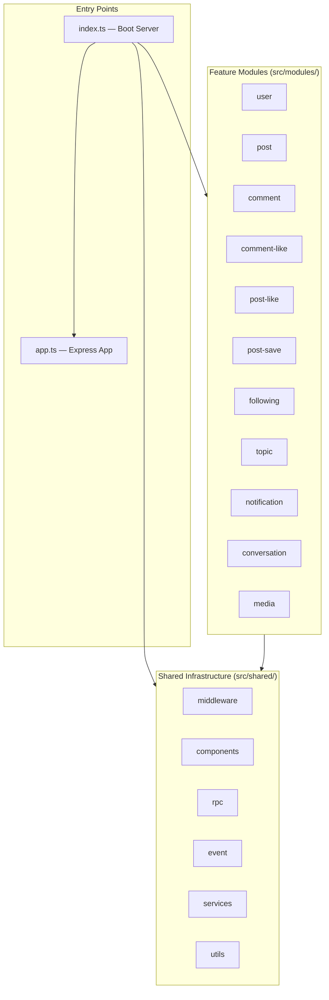
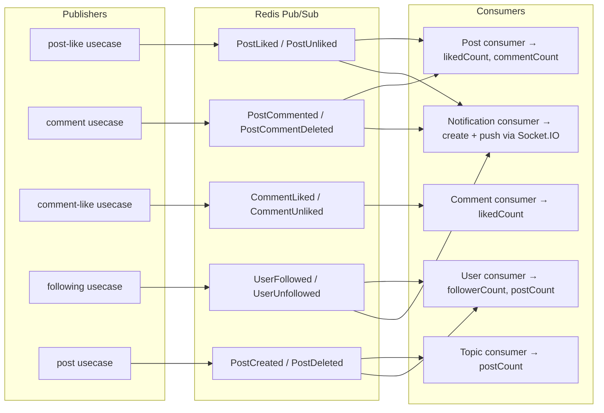

# Codebase Roadmap — `bento-microservices-express/src/`

> A navigational guide to every component, its responsibility, and where to find it.

---

## Architecture Overview



### Pattern per Module (Clean Architecture)

```
module.ts           ← DI wiring: assembles repository + usecase + http-service
├── model/          ← Domain types, Zod schemas, error constants
├── interface/      ← Port interfaces (IRepository, IUseCase, IRpc)
├── usecase/        ← Business logic (validates, orchestrates, publishes events)
└── infras/
    ├── repository/mysql/  ← Prisma data-access (implements IRepository)
    ├── repository/rpc/    ← HTTP calls to other modules (implements IRpc)
    └── transport/
        ├── http-service.ts    ← Express route handlers + route definitions
        └── redis-consumer.ts  ← Async event handlers (subscribes to Redis channels)
```

---

## Module Map

### 1. User (`src/modules/user/`)

| File | Purpose |
|------|---------|
| [module.ts](file:///home/vo/Documents/SideHustle/Social-network-500bros/bento-microservices-express/src/modules/user/module.ts) | Wires repository → usecase → http-service. Also sets up password reset + user stats sub-modules |
| [usecase/index.ts](file:///home/vo/Documents/SideHustle/Social-network-500bros/bento-microservices-express/src/modules/user/usecase/index.ts) | Register, login (bcrypt + JWT), profile CRUD, admin user management |
| [usecase/password-reset.usecase.ts](file:///home/vo/Documents/SideHustle/Social-network-500bros/bento-microservices-express/src/modules/user/usecase/password-reset.usecase.ts) | Forgot/reset password flow with email service |
| [usecase/user-stats.usecase.ts](file:///home/vo/Documents/SideHustle/Social-network-500bros/bento-microservices-express/src/modules/user/usecase/user-stats.usecase.ts) | User statistics endpoint |
| [infras/repository/index.ts](file:///home/vo/Documents/SideHustle/Social-network-500bros/bento-microservices-express/src/modules/user/infras/repository/index.ts) | `PrismaUserRepository` (composed of Query + Command repos) |
| [user.controller.ts](file:///home/vo/Documents/SideHustle/Social-network-500bros/bento-microservices-express/src/modules/user/user.controller.ts) | ⚠️ **Old pattern** — direct Prisma calls in controller (avatar upload, profile, search users) |
| [user.route.ts](file:///home/vo/Documents/SideHustle/Social-network-500bros/bento-microservices-express/src/modules/user/user.route.ts) | ⚠️ **Old pattern** — tsyringe DI, mounted at `/v1/users` in `app.ts` |
| [infras/transport/redis-consumer.ts](file:///home/vo/Documents/SideHustle/Social-network-500bros/bento-microservices-express/src/modules/user/infras/transport/redis-consumer.ts) | Listens: `UserFollowed`, `UserUnfollowed`, `PostCreated`, `PostDeleted` → updates counters |

**Routes:**

| Method | Path | Auth | Description |
|--------|------|------|-------------|
| POST | `/register` | ❌ | User registration |
| POST | `/authenticate` | ❌ | Login → returns JWT |
| GET | `/profile` | ✅ | Get current user profile |
| PATCH | `/profile` | ✅ | Update profile |
| POST | `/forgot-password` | ❌ | Request password reset email |
| POST | `/reset-password` | ❌ | Submit new password with token |
| GET | `/users/:userId/stats` | ❌ | User statistics |
| POST | `/users` | ✅ Admin | Admin create user |
| GET | `/users/:id` | ❌ | Get user detail |
| GET | `/users` | ❌ | List/search users |
| PATCH | `/users/:id` | ✅ Admin | Admin update user |
| DELETE | `/users/:id` | ✅ Admin | Admin delete user |

> ⚠️ **Note:** User module has **dual architecture** — old controller (`user.controller.ts` + `user.route.ts`) mounted in `app.ts`, AND new Clean Architecture (`module.ts`) mounted in `index.ts`. Both serve `/v1/users` paths, which can cause route conflicts.

---

### 2. Post (`src/modules/post/`)

| File | Purpose |
|------|---------|
| [module.ts](file:///home/vo/Documents/SideHustle/Social-network-500bros/bento-microservices-express/src/modules/post/module.ts) | Wires repo + RPCs (topic, user, postLike, postSaved) → usecase → http-service + feed |
| [usecase/index.ts](file:///home/vo/Documents/SideHustle/Social-network-500bros/bento-microservices-express/src/modules/post/usecase/index.ts) | Create (validates topic+author via RPC), update (owner check), delete (publishes events) |
| [usecase/feed.usecase.ts](file:///home/vo/Documents/SideHustle/Social-network-500bros/bento-microservices-express/src/modules/post/usecase/feed.usecase.ts) | Trending posts + latest-by-topic feed logic |
| [infras/repository/mysql/index.ts](file:///home/vo/Documents/SideHustle/Social-network-500bros/bento-microservices-express/src/modules/post/infras/repository/mysql/index.ts) | Prisma CRUD + `increaseCount`/`decreaseCount` for counters |
| [infras/repository/rpc/index.ts](file:///home/vo/Documents/SideHustle/Social-network-500bros/bento-microservices-express/src/modules/post/infras/repository/rpc/index.ts) | `TopicQueryRPC`, `PostLikedRPC`, `PostSavedRPC` — HTTP calls to other modules |
| [infras/transport/http-service.ts](file:///home/vo/Documents/SideHustle/Social-network-500bros/bento-microservices-express/src/modules/post/infras/transport/http-service.ts) | REST handlers + hydrates author/topic/hasLiked/hasSaved per post |
| [infras/transport/redis-consumer.ts](file:///home/vo/Documents/SideHustle/Social-network-500bros/bento-microservices-express/src/modules/post/infras/transport/redis-consumer.ts) | Listens: `PostLiked`, `PostUnliked`, `PostCommented`, `PostCommentDeleted` → updates counters |

**Routes:**

| Method | Path | Auth | Description |
|--------|------|------|-------------|
| POST | `/posts` | ✅ | Create post |
| GET | `/posts` | Optional | List posts (paginated, filtered) |
| GET | `/posts/:id` | Optional | Get single post with author/topic |
| PATCH | `/posts/:id` | ✅ | Update post (owner only) |
| DELETE | `/posts/:id` | ✅ | Delete post (owner only) |
| GET | `/feed/trending` | ❌ | Trending posts feed |
| GET | `/feed/topics/:topicId` | ❌ | Posts by topic |
| POST | `/rpc/posts/list-by-ids` | ❌ | Internal RPC |
| GET | `/rpc/posts/:id` | ❌ | Internal RPC |

---

### 3. Comment (`src/modules/comment/`)

| File | Purpose |
|------|---------|
| [module.ts](file:///home/vo/Documents/SideHustle/Social-network-500bros/bento-microservices-express/src/modules/comment/module.ts) | Wires repo + RPCs (post, user) → usecase → http-service |
| [usecase/comment.ts](file:///home/vo/Documents/SideHustle/Social-network-500bros/bento-microservices-express/src/modules/comment/usecase/comment.ts) | Create comment (validates post), like/dislike, reply (nested), delete |
| [infras/repository/mysql/index.ts](file:///home/vo/Documents/SideHustle/Social-network-500bros/bento-microservices-express/src/modules/comment/infras/repository/mysql/index.ts) | Prisma CRUD + ⚠️ `$queryRawUnsafe` in `findByIds` (SQL injection risk) |
| [infras/transport/redis-consumer.ts](file:///home/vo/Documents/SideHustle/Social-network-500bros/bento-microservices-express/src/modules/comment/infras/transport/redis-consumer.ts) | Listens: `CommentLiked`, `CommentUnliked` → updates `likedCount` |

**Supports:** Top-level comments + nested replies (`parentId` self-reference).

---

### 4. Comment-Like (`src/modules/comment-like/`)

| File | Purpose |
|------|---------|
| [module.ts](file:///home/vo/Documents/SideHustle/Social-network-500bros/bento-microservices-express/src/modules/comment-like/module.ts) | Wires repo + commentQueryRpc → usecase → http-service |
| [usecase/index.ts](file:///home/vo/Documents/SideHustle/Social-network-500bros/bento-microservices-express/src/modules/comment-like/usecase/index.ts) | Like/unlike a comment (validates comment via RPC, publishes events) |

---

### 5. Post-Like (`src/modules/post-like/`)

| File | Purpose |
|------|---------|
| [module.ts](file:///home/vo/Documents/SideHustle/Social-network-500bros/bento-microservices-express/src/modules/post-like/module.ts) | Wires repo + postQueryRpc → usecase → http-service |
| [usecase/index.ts](file:///home/vo/Documents/SideHustle/Social-network-500bros/bento-microservices-express/src/modules/post-like/usecase) | Like/unlike a post (validates post via RPC, publishes `PostLiked`/`PostUnliked` events) |

---

### 6. Post-Save (`src/modules/post-save/`)

| File | Purpose |
|------|---------|
| [module.ts](file:///home/vo/Documents/SideHustle/Social-network-500bros/bento-microservices-express/src/modules/post-save/module.ts) | Wires repo + postRpc + userRpc + topicRpc → usecase → http-service |
| Usecase | Save/unsave a post (bookmark), list saved posts (hydrated with post/author/topic data) |

---

### 7. Following (`src/modules/following/`)

| File | Purpose |
|------|---------|
| [module.ts](file:///home/vo/Documents/SideHustle/Social-network-500bros/bento-microservices-express/src/modules/following/module.ts) | Wires repo + userRpc → usecase → http-service |
| [usecase/index.ts](file:///home/vo/Documents/SideHustle/Social-network-500bros/bento-microservices-express/src/modules/following/usecase/index.ts) | Follow/unfollow user (publishes `UserFollowed`/`UserUnfollowed` events) |
| [infras/repository/mysql/index.ts](file:///home/vo/Documents/SideHustle/Social-network-500bros/bento-microservices-express/src/modules/following/infras/repository/mysql/index.ts) | Prisma: composite key `followingId_followerId`, `whoAmIFollowing` batch check |

---

### 8. Topic (`src/modules/topic/`)

| File | Purpose |
|------|---------|
| [module.ts](file:///home/vo/Documents/SideHustle/Social-network-500bros/bento-microservices-express/src/modules/topic/module.ts) | Wires repo → usecase → http-service |
| Usecase | CRUD topics |
| [infras/transport/redis-consumer.ts](file:///home/vo/Documents/SideHustle/Social-network-500bros/bento-microservices-express/src/modules/topic/infras/transport/redis-consumer.ts) | Listens: `PostCreated`, `PostDeleted` → updates `postCount` |

---

### 9. Notification (`src/modules/notification/`)

| File | Purpose |
|------|---------|
| [module.ts](file:///home/vo/Documents/SideHustle/Social-network-500bros/bento-microservices-express/src/modules/notification/module.ts) | Wires repo + userRpc → usecase → http + Redis consumer |
| [infras/transport/redis-consumer.ts](file:///home/vo/Documents/SideHustle/Social-network-500bros/bento-microservices-express/src/modules/notification/infras/transport/redis-consumer.ts) | Listens: `PostLiked`, `PostCommented`, `UserFollowed` → generates + stores notifications, pushes via Socket.IO |
| Http-service | List notifications, mark as read |

---

### 10. Conversation (`src/modules/conversation/`)

| File | Purpose |
|------|---------|
| [module.ts](file:///home/vo/Documents/SideHustle/Social-network-500bros/bento-microservices-express/src/modules/conversation/module.ts) | Simple router wrapping `conversation.route.ts` |
| [conversation.controller.ts](file:///home/vo/Documents/SideHustle/Social-network-500bros/bento-microservices-express/src/modules/conversation/conversation.controller.ts) | ⚠️ **Does NOT follow Clean Architecture** — direct Prisma calls in controller. Manages conversations, messages, message reactions, participant management |
| [conversation.service.ts](file:///home/vo/Documents/SideHustle/Social-network-500bros/bento-microservices-express/src/modules/conversation/conversation.service.ts) | Partial service layer (find/create conversations only) |

> ⚠️ References `prisma.conversation`, `prisma.message`, `prisma.conversationParticipant`, `prisma.messageReaction` — **models NOT in `schema.prisma`**. These likely come from a separate schema or need to be added.

---

### 11. Media (`src/modules/media/`)

| File | Purpose |
|------|---------|
| [module.ts](file:///home/vo/Documents/SideHustle/Social-network-500bros/bento-microservices-express/src/modules/media/module.ts) | Single `POST /upload-file` endpoint |
| [infra/transport/http-service.ts](file:///home/vo/Documents/SideHustle/Social-network-500bros/bento-microservices-express/src/modules/media/infra/transport/http-service.ts) | Uploads file to Cloudinary, returns URL |

---

## Shared Infrastructure (`src/shared/`)

### Components

| File | Purpose |
|------|---------|
| [config.ts](file:///home/vo/Documents/SideHustle/Social-network-500bros/bento-microservices-express/src/shared/components/config.ts) | Env-based config: port, JWT secret, RPC URLs, Redis, DB, Cloudinary |
| [prisma/index.ts](file:///home/vo/Documents/SideHustle/Social-network-500bros/bento-microservices-express/src/shared/components/prisma/index.ts) | Singleton `PrismaClient` export |
| [jwt.ts](file:///home/vo/Documents/SideHustle/Social-network-500bros/bento-microservices-express/src/shared/components/jwt.ts) | JWT token generation + verification |
| [redis-pubsub/redis.ts](file:///home/vo/Documents/SideHustle/Social-network-500bros/bento-microservices-express/src/shared/components/redis-pubsub/redis.ts) | `RedisClient` singleton: pub/sub for inter-module events |
| [socket/socket.service.ts](file:///home/vo/Documents/SideHustle/Social-network-500bros/bento-microservices-express/src/shared/components/socket/socket.service.ts) | Socket.IO singleton for real-time push (notifications, chat) |

### Events (Redis Channels)

| File | Events |
|------|--------|
| [post.evt.ts](file:///home/vo/Documents/SideHustle/Social-network-500bros/bento-microservices-express/src/shared/event/post.evt.ts) | `PostLiked`, `PostUnliked`, `PostCommented`, `PostCommentDeleted` |
| [topic.evt.ts](file:///home/vo/Documents/SideHustle/Social-network-500bros/bento-microservices-express/src/shared/event/topic.evt.ts) | `PostCreated`, `PostDeleted` |
| [follow.evt.ts](file:///home/vo/Documents/SideHustle/Social-network-500bros/bento-microservices-express/src/shared/event/follow.evt.ts) | `UserFollowed`, `UserUnfollowed` |
| [comment.evt.ts](file:///home/vo/Documents/SideHustle/Social-network-500bros/bento-microservices-express/src/shared/event/comment.evt.ts) | `CommentLiked`, `CommentUnliked` |
| [chatting.evt.ts](file:///home/vo/Documents/SideHustle/Social-network-500bros/bento-microservices-express/src/shared/event/chatting.evt.ts) | Chat-related events |

### RPC Clients (Internal HTTP)

| File | Calls |
|------|-------|
| [user-rpc.ts](file:///home/vo/Documents/SideHustle/Social-network-500bros/bento-microservices-express/src/shared/rpc/user-rpc.ts) | `GET /rpc/users/:id`, `POST /rpc/users/list-by-ids` |
| [post-rpc.ts](file:///home/vo/Documents/SideHustle/Social-network-500bros/bento-microservices-express/src/shared/rpc/post-rpc.ts) | `GET /rpc/posts/:id`, `POST /rpc/posts/list-by-ids` |
| [verify-token.ts](file:///home/vo/Documents/SideHustle/Social-network-500bros/bento-microservices-express/src/shared/rpc/verify-token.ts) | `POST /rpc/introspect` (token validation via HTTP) |

### Middleware

| File | Purpose |
|------|---------|
| [auth.ts](file:///home/vo/Documents/SideHustle/Social-network-500bros/bento-microservices-express/src/shared/middleware/auth.ts) | JWT auth middleware (calls `/rpc/introspect`) |
| [allow-roles.ts](file:///home/vo/Documents/SideHustle/Social-network-500bros/bento-microservices-express/src/shared/middleware/allow-roles.ts) | Role-based access (admin/user) |
| [rate-limiter.ts](file:///home/vo/Documents/SideHustle/Social-network-500bros/bento-microservices-express/src/shared/middleware/rate-limiter.ts) | Request rate limiting |
| [security.ts](file:///home/vo/Documents/SideHustle/Social-network-500bros/bento-microservices-express/src/shared/middleware/security.ts) | Security headers/checks |
| [validation.ts](file:///home/vo/Documents/SideHustle/Social-network-500bros/bento-microservices-express/src/shared/middleware/validation.ts) | Request validation |
| [audit-logger.ts](file:///home/vo/Documents/SideHustle/Social-network-500bros/bento-microservices-express/src/shared/middleware/audit-logger.ts) | Audit logging |

### Services

| File | Purpose |
|------|---------|
| [cloudinary.service.ts](file:///home/vo/Documents/SideHustle/Social-network-500bros/bento-microservices-express/src/shared/services/cloudinary.service.ts) | Cloudinary upload (buffer → cloud URL) |
| [file-upload.service.ts](file:///home/vo/Documents/SideHustle/Social-network-500bros/bento-microservices-express/src/shared/services/file-upload.service.ts) | Multer config for image-only uploads |

### Utilities

| File | Purpose |
|------|---------|
| [error.ts](file:///home/vo/Documents/SideHustle/Social-network-500bros/bento-microservices-express/src/shared/utils/error.ts) | `AppError` class + common errors (`ErrNotFound`, etc.) |
| [logger.ts](file:///home/vo/Documents/SideHustle/Social-network-500bros/bento-microservices-express/src/shared/utils/logger.ts) | Custom logger utility |
| [utils.ts](file:///home/vo/Documents/SideHustle/Social-network-500bros/bento-microservices-express/src/shared/utils/utils.ts) | `successResponse`, `paginatedResponse` helpers |
| [request.ts](file:///home/vo/Documents/SideHustle/Social-network-500bros/bento-microservices-express/src/shared/utils/request.ts) | `pickParam` request helper |
| [media.ts](file:///home/vo/Documents/SideHustle/Social-network-500bros/bento-microservices-express/src/shared/utils/media.ts) | Media file utilities |

---

## Event Flow Diagram



---

## Other Entry Files

| File | Purpose |
|------|---------|
| [src/seed/topics.ts](file:///home/vo/Documents/SideHustle/Social-network-500bros/bento-microservices-express/src/seed/topics.ts) | Seeds default topics into DB |
| [src/cleanup.ts](file:///home/vo/Documents/SideHustle/Social-network-500bros/bento-microservices-express/src/cleanup.ts) | Deletes orphaned `post_likes` rows (where post was deleted) |

---

## ⚠️ Architectural Inconsistencies

| Issue | Location | Impact |
|-------|----------|--------|
| **Dual architecture on User** | `user.controller.ts` + `user.route.ts` (old) vs `module.ts` (new) | Route conflicts on `/v1/users`, `/v1/profile` |
| **Conversation skips Clean Arch** | `conversation.controller.ts` has raw Prisma calls | No testability, no separation of concerns |
| **Conversation references missing models** | `prisma.conversation`, `prisma.message`, etc. | These models are NOT in `schema.prisma` |
| **RPC is HTTP to self** | All modules call each other via `localhost` HTTP | Works in monolith mode; enables future split into microservices |
