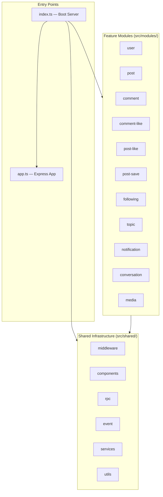
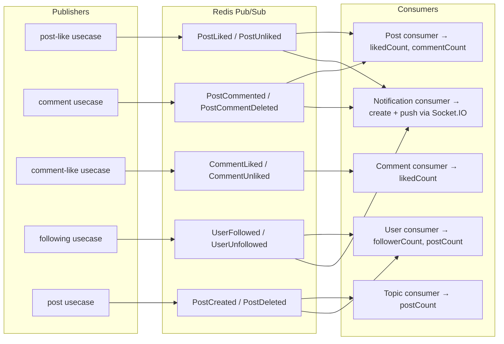

# Codebase Roadmap — `bento-microservices-express/src/`

> A navigational guide to every component, its responsibility, and where to find it.

---

## Architecture Overview



### Pattern per Module (Clean Architecture)

```
module.ts           ← DI wiring: assembles repository + usecase + http-service
├── model/          ← Domain types, Zod schemas, error constants
├── interface/      ← Port interfaces (IRepository, IUseCase, IRpc)
├── usecase/        ← Business logic (validates, orchestrates, publishes events)
└── infras/
    ├── repository/mysql/  ← Prisma data-access (implements IRepository)
    ├── repository/rpc/    ← HTTP calls to other modules (implements IRpc)
    └── transport/
        ├── http-service.ts    ← Express route handlers + route definitions
        └── redis-consumer.ts  ← Async event handlers (subscribes to Redis channels)
```

---

## Module Map

### 1. User (`src/modules/user/`)

| File | Purpose |
|------|---------|
| `application/use-cases/follow-user.usecase.ts` | Follow orchestration with cache warmup + domain event publish |
| `application/use-cases/unfollow-user.usecase.ts` | Unfollow orchestration |
| `application/use-cases/get-profile.usecase.ts` | Profile read flow |
| `application/use-cases/update-profile.usecase.ts` | Profile update flow |
| `infrastructure/repositories/prisma-user.repository.ts` | Prisma adapter for clean user repository contract |
| `interfaces/http/follow.routes.ts` | `/v2/users/:userId/follow`, `/v2/users/:userId/unfollow` |
| `interfaces/http/profile.routes.ts` | `/v2/users/profile` read + update |
| [usecase/index.ts](file:///home/vo/Documents/SideHustle/Social-network-500bros/bento-microservices-express/src/modules/user/usecase/index.ts) | Register, login (bcrypt + JWT), profile CRUD, admin user management |
| [usecase/password-reset.usecase.ts](file:///home/vo/Documents/SideHustle/Social-network-500bros/bento-microservices-express/src/modules/user/usecase/password-reset.usecase.ts) | Forgot/reset password flow with email service |
| [usecase/user-stats.usecase.ts](file:///home/vo/Documents/SideHustle/Social-network-500bros/bento-microservices-express/src/modules/user/usecase/user-stats.usecase.ts) | User statistics endpoint |
| [infras/repository/index.ts](file:///home/vo/Documents/SideHustle/Social-network-500bros/bento-microservices-express/src/modules/user/infras/repository/index.ts) | `PrismaUserRepository` (composed of Query + Command repos) |
| [user.controller.ts](file:///home/vo/Documents/SideHustle/Social-network-500bros/bento-microservices-express/src/modules/user/user.controller.ts) | ⚠️ **Old pattern** — direct Prisma calls in controller (avatar upload, profile, search users) |
| [user.route.ts](file:///home/vo/Documents/SideHustle/Social-network-500bros/bento-microservices-express/src/modules/user/user.route.ts) | ⚠️ **Old pattern** — tsyringe DI, mounted at `/v1/users` in `app.ts` |
| [infras/transport/redis-consumer.ts](file:///home/vo/Documents/SideHustle/Social-network-500bros/bento-microservices-express/src/modules/user/infras/transport/redis-consumer.ts) | Listens: `UserFollowed`, `UserUnfollowed`, `PostCreated`, `PostDeleted` → updates counters |

> Legacy user module entrypoint `src/modules/user/module.ts` was removed from runtime wiring during clean-v2 cutover. Legacy subfolders are retained temporarily for phased decommission.

**Routes:**

| Method | Path | Auth | Description |
|--------|------|------|-------------|
| POST | `/register` | ❌ | User registration |
| POST | `/authenticate` | ❌ | Login → returns JWT |
| GET | `/profile` | ✅ | Get current user profile |
| PATCH | `/profile` | ✅ | Update profile |
| POST | `/forgot-password` | ❌ | Request password reset email |
| POST | `/reset-password` | ❌ | Submit new password with token |
| GET | `/users/:userId/stats` | ❌ | User statistics |
| POST | `/users` | ✅ Admin | Admin create user |
| GET | `/users/:id` | ❌ | Get user detail |
| GET | `/users` | ❌ | List/search users |
| PATCH | `/users/:id` | ✅ Admin | Admin update user |
| DELETE | `/users/:id` | ✅ Admin | Admin delete user |

> ⚠️ **Note:** User module has **dual architecture** — old controller (`user.controller.ts` + `user.route.ts`) mounted in `app.ts`, AND new Clean Architecture (`module.ts`) mounted in `index.ts`. Both serve `/v1/users` paths, which can cause route conflicts.

---

### 2. Post (`src/modules/post/`)

| File | Purpose |
|------|---------|
| `application/use-cases/create-post.usecase.ts` | Create post + publish `post.created` domain event |
| `application/use-cases/get-feed.usecase.ts` | Cache-first feed read flow (Redis + fallback) |
| `application/use-cases/get-post-detail.usecase.ts` | Post detail read flow |
| `application/use-cases/explore-posts.usecase.ts` | Explore/search posts |
| `application/use-cases/update-post.usecase.ts` | Update post with ownership/admin checks |
| `application/use-cases/delete-post.usecase.ts` | Delete post with ownership/admin checks |
| `infrastructure/repositories/prisma-post.repository.ts` | Prisma adapters for post + follow read/write contracts |
| `infrastructure/events/post-created-feed.projector.ts` | Fan-out on write to feed cache on `post.created` |
| `interfaces/http/post.routes.ts` | `/v2` post/feed/explore endpoints |
| [usecase/index.ts](file:///home/vo/Documents/SideHustle/Social-network-500bros/bento-microservices-express/src/modules/post/usecase/index.ts) | Create (validates topic+author via RPC), update (owner check), delete (publishes events) |
| [usecase/feed.usecase.ts](file:///home/vo/Documents/SideHustle/Social-network-500bros/bento-microservices-express/src/modules/post/usecase/feed.usecase.ts) | Trending posts + latest-by-topic feed logic |
| [infras/repository/mysql/index.ts](file:///home/vo/Documents/SideHustle/Social-network-500bros/bento-microservices-express/src/modules/post/infras/repository/mysql/index.ts) | Prisma CRUD + `increaseCount`/`decreaseCount` for counters |
| [infras/repository/rpc/index.ts](file:///home/vo/Documents/SideHustle/Social-network-500bros/bento-microservices-express/src/modules/post/infras/repository/rpc/index.ts) | `TopicQueryRPC`, `PostLikedRPC`, `PostSavedRPC` — HTTP calls to other modules |
| [infras/transport/http-service.ts](file:///home/vo/Documents/SideHustle/Social-network-500bros/bento-microservices-express/src/modules/post/infras/transport/http-service.ts) | REST handlers + hydrates author/topic/hasLiked/hasSaved per post |
| [infras/transport/redis-consumer.ts](file:///home/vo/Documents/SideHustle/Social-network-500bros/bento-microservices-express/src/modules/post/infras/transport/redis-consumer.ts) | Listens: `PostLiked`, `PostUnliked`, `PostCommented`, `PostCommentDeleted` → updates counters |

> Legacy post module entrypoint `src/modules/post/module.ts` was removed from runtime wiring during clean-v2 cutover. Legacy subfolders are retained temporarily for phased decommission.

**Routes:**

| Method | Path | Auth | Description |
|--------|------|------|-------------|
| POST | `/posts` | ✅ | Create post |
| GET | `/posts` | Optional | List posts (paginated, filtered) |
| GET | `/posts/:id` | Optional | Get single post with author/topic |
| PATCH | `/posts/:id` | ✅ | Update post (owner only) |
| DELETE | `/posts/:id` | ✅ | Delete post (owner only) |
| GET | `/feed/trending` | ❌ | Trending posts feed |
| GET | `/feed/topics/:topicId` | ❌ | Posts by topic |
| POST | `/rpc/posts/list-by-ids` | ❌ | Internal RPC |
| GET | `/rpc/posts/:id` | ❌ | Internal RPC |

---

### 3. Comment (`src/modules/comment/`)

| File | Purpose |
|------|---------|
| `application/use-cases/create-comment.usecase.ts` | Create comment + publish domain event |
| `application/use-cases/list-comments.usecase.ts` | List comments by post |
| `application/use-cases/update-comment.usecase.ts` | Update comment with ownership/admin logic |
| `application/use-cases/delete-comment.usecase.ts` | Delete comment with ownership/admin logic |
| `domain/entities/comment.entity.ts` | Comment entity + invariants |
| `infrastructure/repositories/prisma-comment.repository.ts` | Prisma adapter for clean comment repository |
| `interfaces/http/comment.routes.ts` | `/v2` comment endpoints |
| [usecase/comment.ts](file:///home/vo/Documents/SideHustle/Social-network-500bros/bento-microservices-express/src/modules/comment/usecase/comment.ts) | Create comment (validates post), like/dislike, reply (nested), delete |
| [infras/repository/mysql/index.ts](file:///home/vo/Documents/SideHustle/Social-network-500bros/bento-microservices-express/src/modules/comment/infras/repository/mysql/index.ts) | Prisma CRUD + ⚠️ `$queryRawUnsafe` in `findByIds` (SQL injection risk) |
| [infras/transport/redis-consumer.ts](file:///home/vo/Documents/SideHustle/Social-network-500bros/bento-microservices-express/src/modules/comment/infras/transport/redis-consumer.ts) | Listens: `CommentLiked`, `CommentUnliked` → updates `likedCount` |

> Legacy comment module entrypoint `src/modules/comment/module.ts` was removed from runtime wiring during clean-v2 cutover. Legacy subfolders are retained temporarily for phased decommission.

**Supports:** Top-level comments + nested replies (`parentId` self-reference).

---

### 4. Comment-Like (`src/modules/comment-like/`)

| File | Purpose |
|------|---------|
| `usecase/index.ts` | Legacy comment-like use cases (v1 path) |
| `infras/repository/mysql/index.ts` | Legacy comment-like persistence adapter |
| `infras/transport/http-service.ts` | Legacy comment-like HTTP transport |
| [usecase/index.ts](file:///home/vo/Documents/SideHustle/Social-network-500bros/bento-microservices-express/src/modules/comment-like/usecase/index.ts) | Like/unlike a comment (validates comment via RPC, publishes events) |

> Legacy comment-like module entrypoint `src/modules/comment-like/module.ts` was removed from runtime wiring during clean-v2 cutover.

---

### 5. Post-Like (`src/modules/post-like/`)

| File | Purpose |
|------|---------|
| `application/use-cases/like-post.usecase.ts` | Clean like-post orchestration + `post.liked` event publish |
| `infrastructure/repositories/prisma-like.repository.ts` | Prisma adapter for like commands and read model |
| `interfaces/http/like.routes.ts` | `/v2/posts/:postId/like` endpoint |
| [usecase/index.ts](file:///home/vo/Documents/SideHustle/Social-network-500bros/bento-microservices-express/src/modules/post-like/usecase) | Like/unlike a post (validates post via RPC, publishes `PostLiked`/`PostUnliked` events) |

> Legacy post-like module entrypoint `src/modules/post-like/module.ts` was removed from runtime wiring during clean-v2 cutover.

---

### 6. Post-Save (`src/modules/post-save/`)

| File | Purpose |
|------|---------|
| `application/use-cases/save-post.usecase.ts` | Clean bookmark save orchestration |
| `application/use-cases/unsave-post.usecase.ts` | Clean bookmark unsave orchestration |
| `application/use-cases/list-saved-posts.usecase.ts` | Clean saved-posts listing flow |
| `infrastructure/repositories/prisma-bookmark.repository.ts` | Prisma adapter for bookmarks |
| `interfaces/http/bookmark.routes.ts` | `/v2/bookmarks` endpoints |
| Usecase | Save/unsave a post (bookmark), list saved posts (hydrated with post/author/topic data) |

> Legacy post-save module entrypoint `src/modules/post-save/module.ts` was removed from runtime wiring during clean-v2 cutover.

---

### 7. Following (`src/modules/following/`)

| File | Purpose |
|------|---------|
| `application/use-cases/follow-user.usecase.ts` | Clean follow orchestration + event publish |
| `application/use-cases/unfollow-user.usecase.ts` | Clean unfollow orchestration |
| `interfaces/http/follow.routes.ts` | `/v2/users/:userId/follow` and `/v2/users/:userId/unfollow` |
| `infrastructure/repositories/prisma-post.repository.ts` | Follow persistence adapter used by clean follow use cases |
| [usecase/index.ts](file:///home/vo/Documents/SideHustle/Social-network-500bros/bento-microservices-express/src/modules/following/usecase/index.ts) | Follow/unfollow user (publishes `UserFollowed`/`UserUnfollowed` events) |
| [infras/repository/mysql/index.ts](file:///home/vo/Documents/SideHustle/Social-network-500bros/bento-microservices-express/src/modules/following/infras/repository/mysql/index.ts) | Prisma: composite key `followingId_followerId`, `whoAmIFollowing` batch check |

> Legacy following module entrypoint `src/modules/following/module.ts` was removed from runtime wiring during clean-v2 cutover.

---

### 8. Topic (`src/modules/topic/`)

| File | Purpose |
|------|---------|
| `infras/repository/index.ts` | Legacy topic persistence adapter (pre-clean) |
| `usecase/index.ts` | Legacy CRUD topic use cases (pre-clean) |
| `infras/transport/http-service.ts` | Legacy `/v1` topic transport layer |
| Usecase | CRUD topics |
| [infras/transport/redis-consumer.ts](file:///home/vo/Documents/SideHustle/Social-network-500bros/bento-microservices-express/src/modules/topic/infras/transport/redis-consumer.ts) | Listens: `PostCreated`, `PostDeleted` → updates `postCount` |

> Legacy topic module entrypoint `src/modules/topic/module.ts` was removed from runtime wiring during clean-v2 cutover.

---

### 9. Notification (`src/modules/notification/`)

| File | Purpose |
|------|---------|
| `application/use-cases/*` | Create/list/mark-read notification flows (Clean Application layer) |
| `domain/entities/notification.entity.ts` | Notification entity with validation + rehydrate support |
| `infrastructure/repositories/prisma-notification.repository.ts` | Prisma persistence adapter for notification aggregate |
| `infrastructure/events/notification.projector.ts` | Subscribes domain events (`user.followed`, `post.liked`, `comment.created`, ...) and projects notifications |
| `interfaces/http/notification.routes.ts` | `/v2/notifications` APIs (list, mark-read, mark-all-read) |

> Legacy notification files (`module.ts`, `infras/*`, `interface/*`, `model/*`, `usecase/*`, `src/services/notification/index.ts`) were removed during clean-v2 cutover cleanup.

---

### 10. Conversation (`src/modules/conversation/`)

| File | Purpose |
|------|---------|
| [module.ts](file:///home/vo/Documents/SideHustle/Social-network-500bros/bento-microservices-express/src/modules/conversation/module.ts) | Simple router wrapping `conversation.route.ts` |
| [conversation.controller.ts](file:///home/vo/Documents/SideHustle/Social-network-500bros/bento-microservices-express/src/modules/conversation/conversation.controller.ts) | ⚠️ **Does NOT follow Clean Architecture** — direct Prisma calls in controller. Manages conversations, messages, message reactions, participant management |
| [conversation.service.ts](file:///home/vo/Documents/SideHustle/Social-network-500bros/bento-microservices-express/src/modules/conversation/conversation.service.ts) | Partial service layer (find/create conversations only) |

> ⚠️ References `prisma.conversation`, `prisma.message`, `prisma.conversationParticipant`, `prisma.messageReaction` — **models NOT in `schema.prisma`**. These likely come from a separate schema or need to be added.
> Legacy conversation routes were removed from monolith `src/index.ts` boot path; conversation runtime remains in dedicated `src/services/chat/index.ts`.

---

### 11. Media (`src/modules/media/`)

| File | Purpose |
|------|---------|
| [module.ts](file:///home/vo/Documents/SideHustle/Social-network-500bros/bento-microservices-express/src/modules/media/module.ts) | Single `POST /upload-file` endpoint |
| [infra/transport/http-service.ts](file:///home/vo/Documents/SideHustle/Social-network-500bros/bento-microservices-express/src/modules/media/infra/transport/http-service.ts) | Uploads file to Cloudinary, returns URL |

---

## Shared Infrastructure (`src/shared/`)

### Components

| File | Purpose |
|------|---------|
| [config.ts](file:///home/vo/Documents/SideHustle/Social-network-500bros/bento-microservices-express/src/shared/components/config.ts) | Env-based config: port, JWT secret, RPC URLs, Redis, DB, Cloudinary |
| [prisma/index.ts](file:///home/vo/Documents/SideHustle/Social-network-500bros/bento-microservices-express/src/shared/components/prisma/index.ts) | Singleton `PrismaClient` export |
| [jwt.ts](file:///home/vo/Documents/SideHustle/Social-network-500bros/bento-microservices-express/src/shared/components/jwt.ts) | JWT token generation + verification |
| [redis-pubsub/redis.ts](file:///home/vo/Documents/SideHustle/Social-network-500bros/bento-microservices-express/src/shared/components/redis-pubsub/redis.ts) | `RedisClient` singleton: pub/sub for inter-module events |
| [socket/socket.service.ts](file:///home/vo/Documents/SideHustle/Social-network-500bros/bento-microservices-express/src/shared/components/socket/socket.service.ts) | Socket.IO singleton for real-time push (notifications, chat) |

### Events (Redis Channels)

| File | Events |
|------|--------|
| [post.evt.ts](file:///home/vo/Documents/SideHustle/Social-network-500bros/bento-microservices-express/src/shared/event/post.evt.ts) | `PostLiked`, `PostUnliked`, `PostCommented`, `PostCommentDeleted` |
| [topic.evt.ts](file:///home/vo/Documents/SideHustle/Social-network-500bros/bento-microservices-express/src/shared/event/topic.evt.ts) | `PostCreated`, `PostDeleted` |
| [follow.evt.ts](file:///home/vo/Documents/SideHustle/Social-network-500bros/bento-microservices-express/src/shared/event/follow.evt.ts) | `UserFollowed`, `UserUnfollowed` |
| [comment.evt.ts](file:///home/vo/Documents/SideHustle/Social-network-500bros/bento-microservices-express/src/shared/event/comment.evt.ts) | `CommentLiked`, `CommentUnliked` |
| [chatting.evt.ts](file:///home/vo/Documents/SideHustle/Social-network-500bros/bento-microservices-express/src/shared/event/chatting.evt.ts) | Chat-related events |

### RPC Clients (Internal HTTP)

| File | Calls |
|------|-------|
| [user-rpc.ts](file:///home/vo/Documents/SideHustle/Social-network-500bros/bento-microservices-express/src/shared/rpc/user-rpc.ts) | `GET /rpc/users/:id`, `POST /rpc/users/list-by-ids` |
| [post-rpc.ts](file:///home/vo/Documents/SideHustle/Social-network-500bros/bento-microservices-express/src/shared/rpc/post-rpc.ts) | `GET /rpc/posts/:id`, `POST /rpc/posts/list-by-ids` |
| [verify-token.ts](file:///home/vo/Documents/SideHustle/Social-network-500bros/bento-microservices-express/src/shared/rpc/verify-token.ts) | `POST /rpc/introspect` (token validation via HTTP) |

### Middleware

| File | Purpose |
|------|---------|
| [auth.ts](file:///home/vo/Documents/SideHustle/Social-network-500bros/bento-microservices-express/src/shared/middleware/auth.ts) | JWT auth middleware (calls `/rpc/introspect`) |
| [allow-roles.ts](file:///home/vo/Documents/SideHustle/Social-network-500bros/bento-microservices-express/src/shared/middleware/allow-roles.ts) | Role-based access (admin/user) |
| [rate-limiter.ts](file:///home/vo/Documents/SideHustle/Social-network-500bros/bento-microservices-express/src/shared/middleware/rate-limiter.ts) | Request rate limiting |
| [security.ts](file:///home/vo/Documents/SideHustle/Social-network-500bros/bento-microservices-express/src/shared/middleware/security.ts) | Security headers/checks |
| [validation.ts](file:///home/vo/Documents/SideHustle/Social-network-500bros/bento-microservices-express/src/shared/middleware/validation.ts) | Request validation |
| [audit-logger.ts](file:///home/vo/Documents/SideHustle/Social-network-500bros/bento-microservices-express/src/shared/middleware/audit-logger.ts) | Audit logging |

### Services

| File | Purpose |
|------|---------|
| [cloudinary.service.ts](file:///home/vo/Documents/SideHustle/Social-network-500bros/bento-microservices-express/src/shared/services/cloudinary.service.ts) | Cloudinary upload (buffer → cloud URL) |
| [file-upload.service.ts](file:///home/vo/Documents/SideHustle/Social-network-500bros/bento-microservices-express/src/shared/services/file-upload.service.ts) | Multer config for image-only uploads |

### Utilities

| File | Purpose |
|------|---------|
| [error.ts](file:///home/vo/Documents/SideHustle/Social-network-500bros/bento-microservices-express/src/shared/utils/error.ts) | `AppError` class + common errors (`ErrNotFound`, etc.) |
| [logger.ts](file:///home/vo/Documents/SideHustle/Social-network-500bros/bento-microservices-express/src/shared/utils/logger.ts) | Custom logger utility |
| [utils.ts](file:///home/vo/Documents/SideHustle/Social-network-500bros/bento-microservices-express/src/shared/utils/utils.ts) | `successResponse`, `paginatedResponse` helpers |
| [request.ts](file:///home/vo/Documents/SideHustle/Social-network-500bros/bento-microservices-express/src/shared/utils/request.ts) | `pickParam` request helper |
| [media.ts](file:///home/vo/Documents/SideHustle/Social-network-500bros/bento-microservices-express/src/shared/utils/media.ts) | Media file utilities |

---

## Event Flow Diagram



---

## Other Entry Files

| File | Purpose |
|------|---------|
| [src/seed/topics.ts](file:///home/vo/Documents/SideHustle/Social-network-500bros/bento-microservices-express/src/seed/topics.ts) | Seeds default topics into DB |
| [src/cleanup.ts](file:///home/vo/Documents/SideHustle/Social-network-500bros/bento-microservices-express/src/cleanup.ts) | Deletes orphaned `post_likes` rows (where post was deleted) |

---

## ⚠️ Architectural Inconsistencies

| Issue | Location | Impact |
|-------|----------|--------|
| **Dual architecture on User** | `user.controller.ts` + `user.route.ts` (old) vs `module.ts` (new) | Route conflicts on `/v1/users`, `/v1/profile` |
| **Conversation skips Clean Arch** | `conversation.controller.ts` has raw Prisma calls | No testability, no separation of concerns |
| **Conversation references missing models** | `prisma.conversation`, `prisma.message`, etc. | These models are NOT in `schema.prisma` |
| **RPC is HTTP to self** | All modules call each other via `localhost` HTTP | Works in monolith mode; enables future split into microservices |
