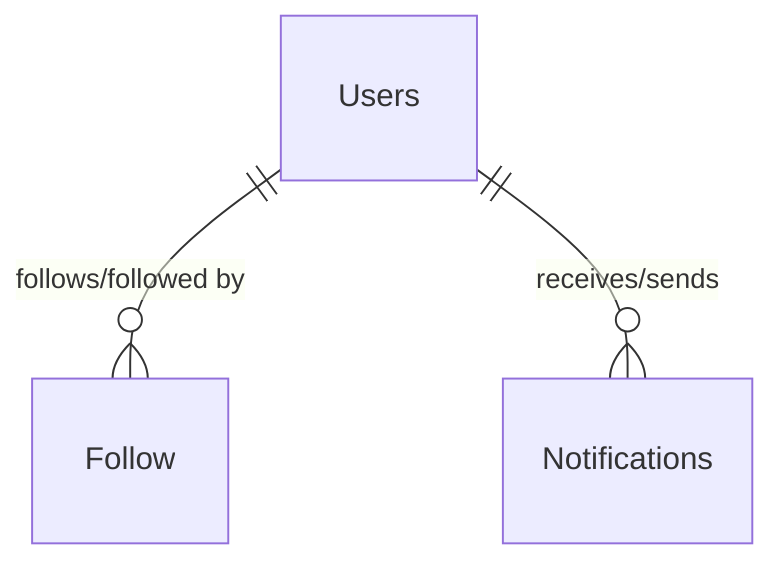
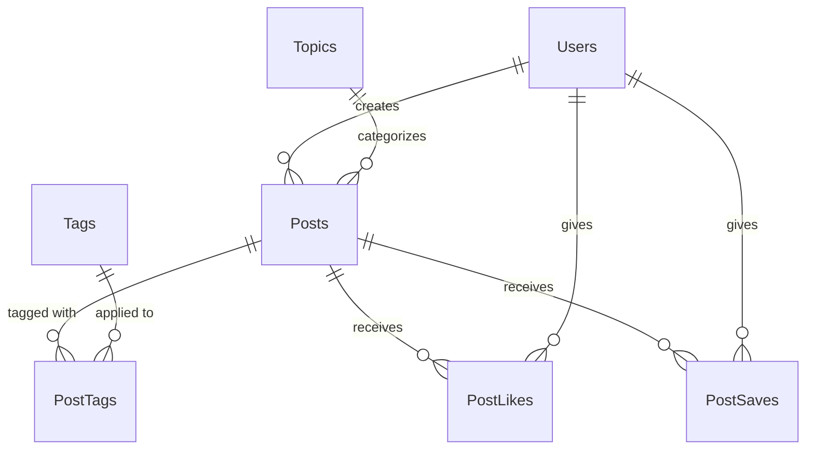
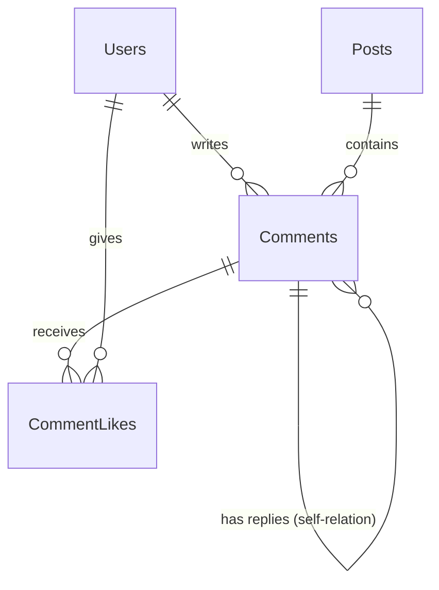
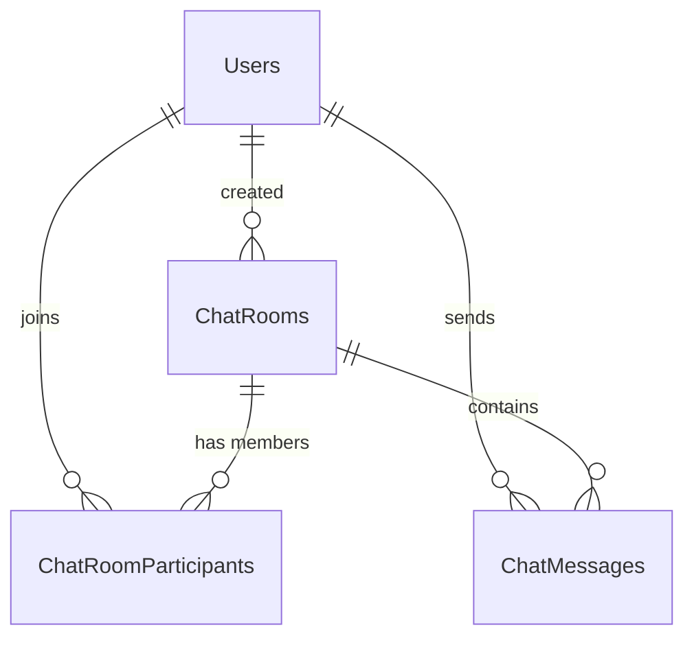
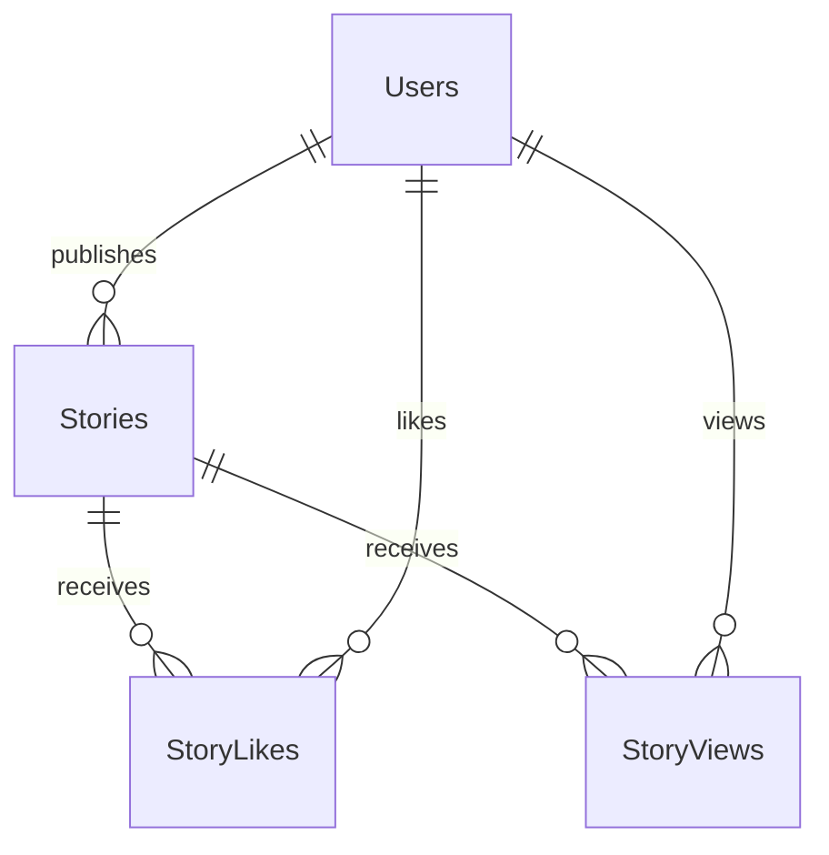

# Prisma Schema Review — [schema.prisma](file:///home/vo/Documents/SideHustle/Social-network-500bros/bento-microservices-express/prisma/schema.prisma)

> Reviewed: 2026-03-30 | Scope: [schema.prisma](file:///home/vo/Documents/SideHustle/Social-network-500bros/bento-microservices-express/prisma/schema.prisma) + source code in `src/modules/`
> **UPDATE:** All schema-level issues (relations, indexes, uniqueness, timestamps) have been **RESOLVED** and applied to `schema.prisma`.

---

## Executive Summary

The schema is **functional but has significant structural gaps** that impact data integrity, type safety, query performance, and security. The biggest issue is **zero Prisma `@relation` definitions** across 14 models, meaning every FK is just a plain `String` field with no referential integrity at the ORM level.

---

## 🔴 Critical Issues

### 1. No `@relation` Definitions — Biggest Gap

**Every foreign key is an orphaned `String` field.** Prisma has no knowledge of your table relationships.

| Model | FK Fields (no `@relation`) |
|-------|---------------------------|
| `ChatMessages` | `roomId → ChatRooms`, `senderId → Users` |
| `ChatRooms` | `creatorId → Users`, `receiverId → Users` |
| `CommentLikes` | `commentId → Comments`, `userId → Users` |
| `Comments` | `userId → Users`, `postId → Posts`, `parentId → Comments` (self-ref) |
| `Followers` | `followerId → Users`, `followingId → Users` |
| `Notifications` | `receiverId → Users`, `actorId → Users` |
| `PostLikes` | `postId → Posts`, `userId → Users` |
| `PostSaves` | `postId → Posts`, `userId → Users` |
| `PostTags` | `postId → Posts`, `tagId → Tags` |
| `Posts` | `authorId → Users`, `topicId → Topics` |
| `Stories` | `userId → Users` |
| `StoryLikes` | `storyId → Stories`, `userId → Users` |
| `StoryViews` | `storyId → Stories`, `userId → Users` |

**Impact:**
- ❌ No cascading deletes — deleting a [User](file:///home/vo/Documents/SideHustle/Social-network-500bros/bento-microservices-express/src/modules/user/infras/repository/index.ts#7-41) orphans posts, comments, likes, etc.
- ❌ No `include`/nested reads — can't do `prisma.posts.findMany({ include: { author: true } })`
- ❌ No referential integrity at ORM level (DB may have FK constraints, but Prisma doesn't know about them)
- ❌ Forces manual multi-query joins in application code (visible in [comment/repository](file:///home/vo/Documents/SideHustle/Social-network-500bros/bento-microservices-express/src/modules/comment/infras/repository/mysql/index.ts))

**Example fix for `Posts`:**

```diff
 model Posts {
   id           String      @id @map("id") @db.VarChar(36)
   content      String      @map("content") @db.Text
   authorId     String      @map("author_id") @db.VarChar(36)
   topicId      String      @map("topic_id") @db.VarChar(36)
+  author       Users       @relation(fields: [authorId], references: [id])
+  topic        Topics      @relation(fields: [topicId], references: [id])
+  comments     Comments[]
+  likes        PostLikes[]
+  saves        PostSaves[]
+  tags         PostTags[]
   // ... rest
 }
```

---

### 2. SQL Injection via `$queryRawUnsafe`

In [comment/repository](file:///home/vo/Documents/SideHustle/Social-network-500bros/bento-microservices-express/src/modules/comment/infras/repository/mysql/index.ts#L33-L36):

```typescript
// 🔴 String interpolation into raw SQL — SQL INJECTION RISK
const sql = ids
  .map((id) => `(SELECT * FROM comments WHERE ${field} = '${id}' ...)`)
  .join(' UNION ');
const replies = await prisma.$queryRawUnsafe<any[]>(sql);
```

**Fix:** Use `$queryRaw` with tagged template literals, or rewrite as a Prisma query.

---

## 🟡 Moderate Issues

### 3. Inconsistent Timestamp Types

Three different timestamp representations are used:

| Type | Used in |
|------|---------|
| `@db.Timestamp(0)` | `ChatMessages`, `Posts`, `Tags`, `Topics`, `Users`, `Notifications` |
| `@db.Timestamp(6)` | `Stories` |
| `@db.DateTime(6)` | `Comments`, `CommentLikes`, `Followers`, `PostLikes`, `PostSaves`, `PostTags`, `StoryLikes`, `StoryViews` |

**Recommendation:** Standardize to one type across the schema (e.g., `@db.Timestamp(0)` for second precision, or `@db.DateTime(6)` if you need microsecond precision).

### 4. Missing `@unique` Constraints

| Field | Issue |
|-------|-------|
| `Users.username` | **No uniqueness!** Two users could have the same username. |
| `Tags.name` | No uniqueness — duplicate tags possible. |
| `Topics.name` | No uniqueness — duplicate topics possible. |

```diff
 model Users {
-  username String @map("username") @db.VarChar(100)
+  username String @unique @map("username") @db.VarChar(100)
 }
```

### 5. Missing `@updatedAt` Directive

All `updatedAt` fields use `@default(now())` but **none use `@updatedAt`**, so Prisma won't auto-update them on writes.

```diff
-  updatedAt DateTime @default(now()) @map("updated_at") @db.Timestamp(0)
+  updatedAt DateTime @updatedAt @map("updated_at") @db.Timestamp(0)
```

This affects: `ChatMessages`, `ChatRooms`, `Posts`, `Tags`, `Topics`, `Users`, `Notifications`.

### 6. Denormalized Counters Without Sync Guarantee

| Model | Counter Fields |
|-------|---------------|
| `Posts` | `commentCount`, `likedCount` |
| `Comments` | `likedCount`, `replyCount` |
| `Users` | `followerCount`, `postCount` |
| `Tags` | `postCount` |
| `Topics` | `postCount` |
| `Stories` | `likeCount`, `viewCount` |

These are updated via [increment](file:///home/vo/Documents/SideHustle/Social-network-500bros/bento-microservices-express/src/modules/user/infras/repository/index.ts#44-48)/[decrement](file:///home/vo/Documents/SideHustle/Social-network-500bros/bento-microservices-express/src/modules/user/infras/repository/index.ts#49-53) calls scattered across repositories, but **there's no transactional guarantee** between the count update and the related row insert/delete. If either fails, counts go out of sync.

**Recommendation:** Wrap count updates + row operations in `$transaction` blocks, or consider using DB triggers.

---

## 🟢 Minor / Best Practice

### 7. `Posts` Ordering by `id` (not timestamp)

In [post/repository](file:///home/vo/Documents/SideHustle/Social-network-500bros/bento-microservices-express/src/modules/post/infras/repository/mysql/index.ts#L52-L54):

```typescript
orderBy: { id: 'desc' }  // UUIDs don't sort chronologically
```

Since IDs are UUIDs (`VarChar(36)`), ordering by `id` gives **random** order, not chronological. Use `createdAt` instead.

### 8. Missing Index on `Notifications.actorId`

`actorId` is used for lookups but has no index:

```diff
 model Notifications {
+  @@index([actorId], map: "actor_id")
 }
```

### 9. Missing Indexes on `Posts.topicId` and `Stories.status`

- `Posts.topicId` — used for topic-based feeds but not indexed
- `Stories.status` — filtered by `active/inactive` but not indexed

### 10. `generator client` Uses Legacy Provider

```prisma
generator client {
  provider = "prisma-client-js"
}
```

If using Prisma 7+ with the adapter pattern (as seen in your past conversations), this should be `prisma-client-ts` with a custom output path.

---

## Priority Matrix

| Priority | Issue | Effort | Impact |
|----------|-------|--------|--------|
| ✅ FIXED | Add `@relation` definitions | High | Data integrity + DX |
| 🔴 P0 | Fix SQL injection in comment repo | Low | Security |
| ✅ FIXED | Add `@unique` to `username`, `Tags.name`, `Topics.name` | Low | Data integrity |
| ✅ FIXED | Add `@updatedAt` to all `updatedAt` fields | Low | Correctness |
| 🟡 P1 | Wrap counter ops in `$transaction` | Medium | Data consistency |
| ✅ FIXED | Standardize timestamp types | Low | Consistency |
| ✅ FIXED | Add missing indexes | Low | Performance |
| 🟢 P3 | Fix `orderBy: id` to `orderBy: createdAt` | Low | Correctness |
| 🟢 P3 | Update generator for Prisma 7+ | Low | Compatibility |

---

## Database Schema Diagrams (Modular)

Because a single diagram with all relations can be difficult to read, the schema is broken down into separate modular diagrams by feature context.

### 1. Users, Social & Notifications


### 2. Posts & Content


### 3. Comments & Engagement


### 4. Chat System


### 5. Stories (Ephemeral Content)

