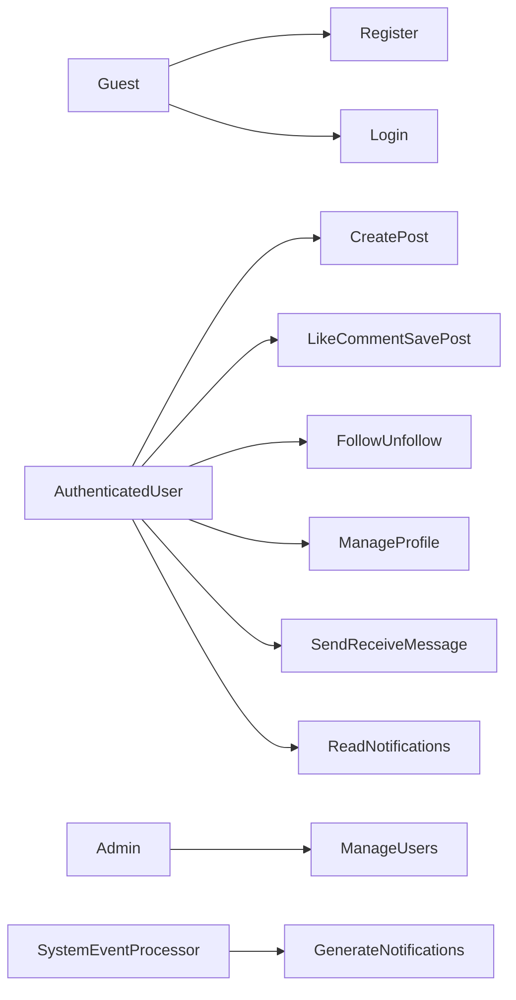
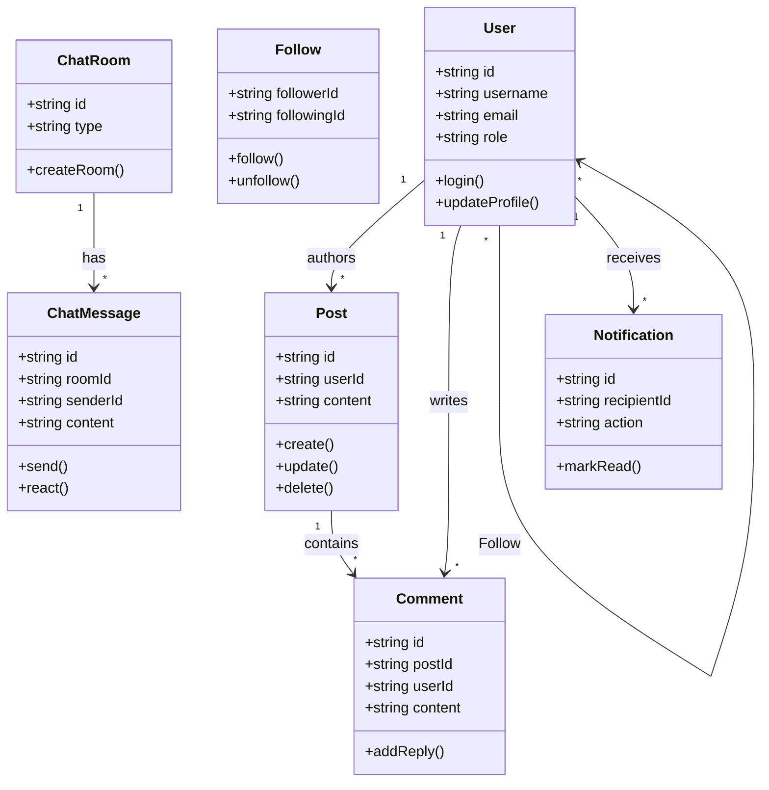
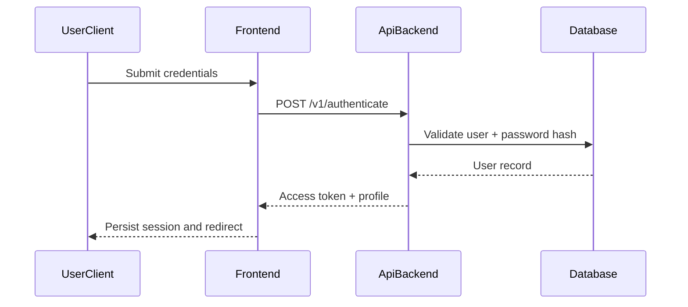
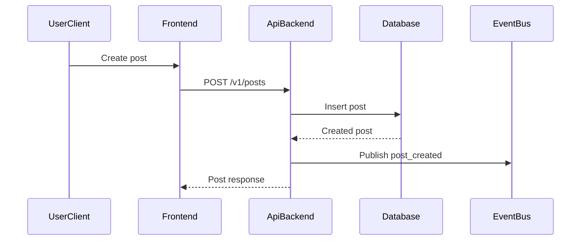
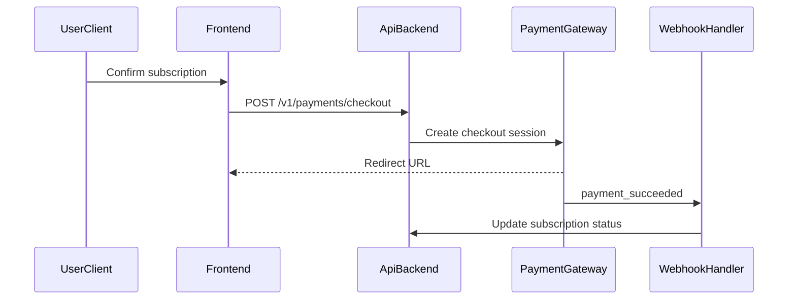
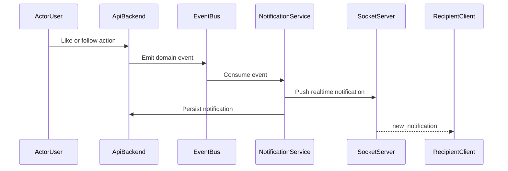
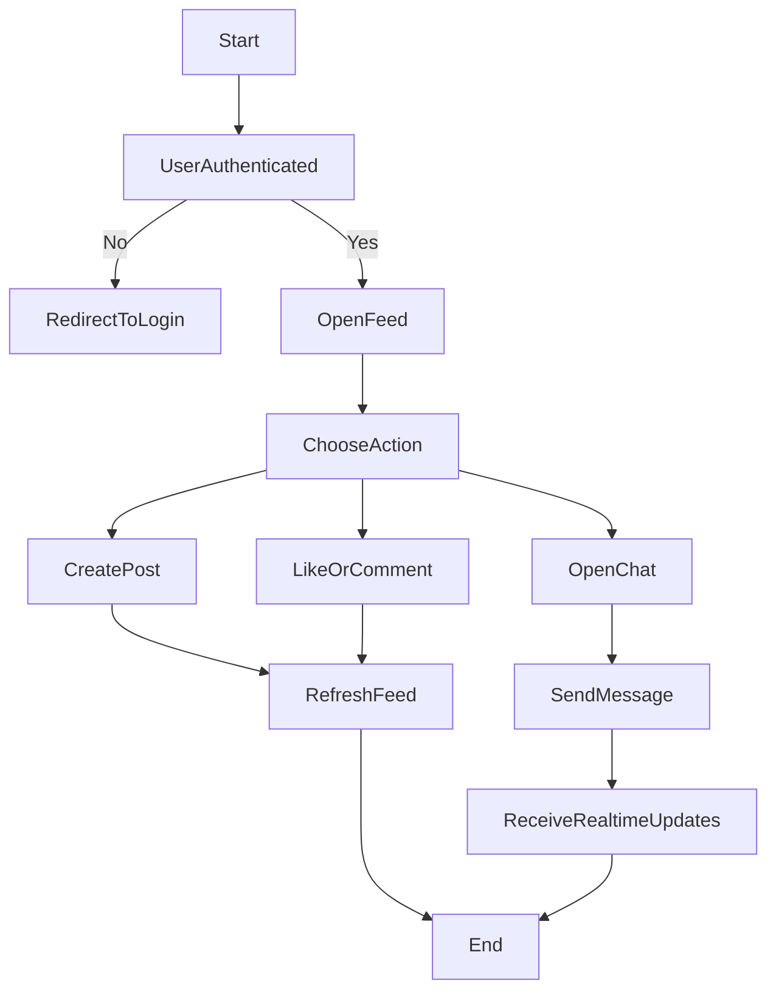
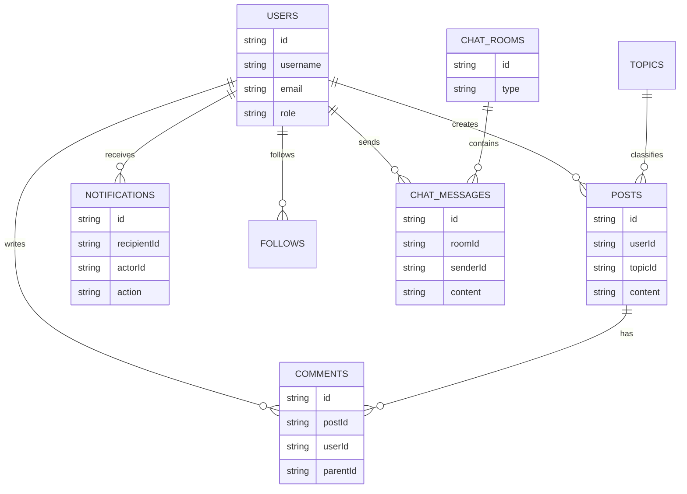

# UML and Data Modeling

## 1. Use Case Diagram

## 2. Class Diagram

## 3. Sequence Diagram - Login Flow

## 4. Sequence Diagram - Create Record (Post)

## 5. Sequence Diagram - Payment (Future Target)

## 6. Sequence Diagram - Notification Flow

## 7. Activity Diagram - Content Interaction Workflow

## 8. ERD (Logical)

